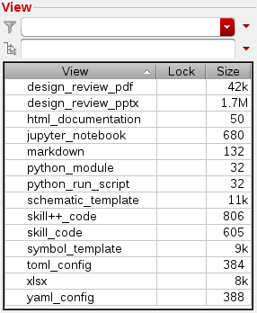
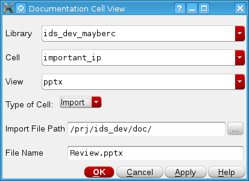

# Softworks

[](https://github.com/cascode-labs/softworks/releases/latest)
[](https://anaconda.org/conda-forge/softworks)
[](https://pypi.org/project/softworks/)
[](https://github.com/cascode-labs/softworks/issues)
[](https://choosealicense.com/licenses/mit/)

Software and documentation view types in the Cadence Virtuoso IC design environment.

## Overview

Softworks defines cell view types for documentation and software views in
the Cadence Virtuoso integrated circuit design environment.  It supports
automated design of circuit IP and makes it accessible to the average designer.  

It is an open-source library written in SKILL++ and built on the
[Virtue SKILL and Python design automation framework](http://www.cascode-labs.org/virtue/).



The software views make automated design more accessible to both the average
IC design engineer and those with software experience.  It allows the
tool interface to be simplified to a simple template run script where the
inputs are defined in a dictionary and passed to an API function.

The documentation views support the development of IP libraries by attaching
the documentation directly to the cells.  This makes it easier to communicate
the performance of the cell and keep track of it.

## Custom Cell Views

| View Type   | Extensions     | Editors          | Description                 |
| ----------- | -------------- | ---------------- | --------------------------- |
| pdf         | *.pdf          | xpdf             | A pdf Document              |
| ppt         | *.pptx         | open office      | A power point presentation  |
| Excel       | *.xlsx \*.xlsm | open office      | A spreadsheet               |
| html        | *.html         | firefox          | A web page                  |
| module      | *.py \*.pyc    | VS Code, gedit   | A Python module             |
| notebook    | *.ipynb        | VS Code, gedit   | A Python Jupyter notebook   |
| markdown    | *.md           | VS Code, gedit   | A markdown document. VS code enables editing and rendering |
| yaml        | *.yml          | VS Code, gedit   | A yaml data file            |
| skill       | *.il           | Skill IDE, gedit | A SKILL code file           |
| skillpp     | *.ils          | Skill IDE, gedit | A SKILL++ code file         |

## Creating a New View

A new blank document view can be created by using the standard "File -> New -> Cell View..." selection.
Then some view types will create a new cellview directly based on a template file while the
documentation views will open a GUI.  This GUI has the option to either create the new cell view from a template or
import an existing file to the cell view.



## License

Softworks is MIT licensed, see the [LICENSE file](LICENSE) for more details.

## Installation

1. Make sure Virtuoso IC6.1.8 (though it may work with other IC6 versions)
   is installed
2. Make sure the following programs are installed to support editing the
   associated views:
   - Visual Studio Code / vscode
     ```which code```
   - Libre office (pptx, xlsx)
     ```which libre```
   - xpdf (PDF)
     ```which xpdf```
   - firefox (HTML)
     ```which firefox```

3. Install by following
  [Virtue framework installation instructions](https://www.cascode-labs.org/virtue/overview/install.html#).  

4. Install Softworks using the same method as Virtue.  If skyworks wasn't a
part of your initial environment definition file when creating the environment,
then you can install them after the fact:

Conda:

```bash
conda activate virtuoso  # or your environment's name
conda install softworks
```

Pip:

```bash
pip install softworks
```
