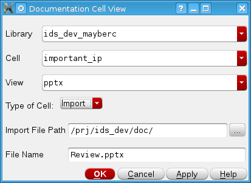

Overview
=========

.. image:: https://img.shields.io/github/v/release/cascode-labs/softworks?include_prereleases
   :alt: GitHub release (latest by date including pre-releases)
   :target: https://github.com/cascode-labs/softworks/releases/latest
.. image:: https://img.shields.io/conda/v/conda-forge/softworks?label=conda-forge
   :alt: Conda
   :target: https://anaconda.org/conda-forge/softworks
.. image:: https://img.shields.io/pypi/v/softworks
   :alt: PyPI
   :target: https://pypi.org/project/softworks/
.. image:: https://img.shields.io/github/issues/cascode-labs/softworks
   :alt: GitHub issues
   :target: https://github.com/cascode-labs/softworks/issues
.. image:: https://img.shields.io/pypi/l/softworks
   :alt: PyPI - License
   :target: https://choosealicense.com/licenses/mit/

Softworks defines cell view types for documentation and software views in 
the Cadence Virtuoso integrated circuit design environment.  It supports 
automated design of circuit IP and makes it accessible to average designer.  
It is an open-source library written in SKILL++ and built on the Virtue SKILL++ 
framework.

.. image:: ../../../docs/source/_static/view_list.png
  :alt: Views supported by Softworks

The software views make automated design more accessible to both the average 
IC design engineer and those with software experience.  It allows the 
tool interface to be simplified to a simple template run script where the
inputs are defined in a dictionary and passed to an API function. 

The documentation views support the development of IP libraries by attaching
the documentation directly to the cells.  This makes it easier to communicate 
the performance of the cell and keep track of it.

Cell View Types
-----------------

+-------------+-----------------+-------------+------------------------------+
| View Type   | Extensions      | Editors     | Description                  |
+=============+=================+=============+==============================+
| pdf         | \*.pdf          | xpdf        | A pdf Document               |
+-------------+-----------------+-------------+------------------------------+
| ppt         | \*.pptx         | open office | A power point presentation   |
+-------------+-----------------+-------------+------------------------------+
| Excel       | \*.xlsx \*.xlsm | open office | A spreadsheet                |
+-------------+-----------------+-------------+------------------------------+
| html        | \*.html         | firefox     | A web page                   |
+-------------+-----------------+-------------+------------------------------+
| module      | \*.py (\*.pyc)  | PyCharm,    | A Python module              |
|             |                 | gedit       |                              |
+-------------+-----------------+-------------+------------------------------+
| notebook    | \*.ipynb        | PyCharm,    | A Python Jupyter notebook    |
|             |                 | gedit       |                              |
+-------------+-----------------+-------------+------------------------------+
| markdown    | \*.md           | PyCharm,    | A markdown document. PyCharm |
|             |                 | gedit       | supports both editing and    |
|             |                 |             | rendering.                   |
+-------------+-----------------+-------------+------------------------------+
| yaml        | \*.yml          | PyCharm,    | A yaml data file             |
|             |                 | gedit       |                              |
+-------------+-----------------+-------------+------------------------------+
| skill       | \*.il           | Skill IDE,  | A SKILL code file            |
|             |                 | gedit       |                              |
+-------------+-----------------+-------------+------------------------------+
| skillpp     | \*.ils          | Skill IDE,  | A SKILL++ code file          |
|             |                 | gedit       |                              |
+-------------+-----------------+-------------+------------------------------+

Creating a New View
-------------------

A new blank document view can be created by using the standard "File -> New -> Cell View..." selection.
Then some view types will create a new cellview directly based on a template file while the
documentation views will open a GUI.  This GUI has the option to either create the new cell view from a template or
import an existing file to the cell view.

.. toctree::
   :caption: Contents:
   :hidden:

   release_notes
